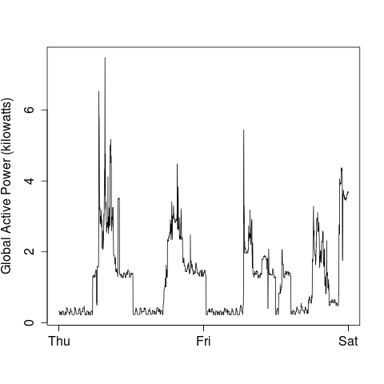
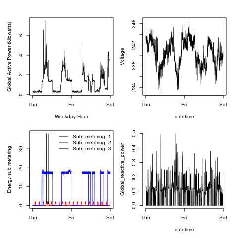

## Introduction

This assingment is fork from <a href="https://github.com/rdpeng/ExData_Plotting1">Plotting Assignment 1 for Exploratory Data Analysis</a>

## Loading the data and running the scripts for plotting

Download data set from
* <b>Dataset</b>: <a href="https://d396qusza40orc.cloudfront.net/exdata%2Fdata%2Fhousehold_power_consumption.zip">Electric power consumption</a> [20Mb]

Run scripts in R by
* source("./plotX.R") - where X is 1 to 4 for corresponding scripts

Output files are png files
* plotX.png           - where X is 1 to 4 for corresponding script output file

## Script output diagrams

### Plot 1

 

### Plot 2

 

### Plot 3

 

### Plot 4

 

### Compare to assignment plots at
<a href="https://github.com/rdpeng/ExData_Plotting1">Plotting Assignment 1 for Exploratory Data Analysis</a> 
